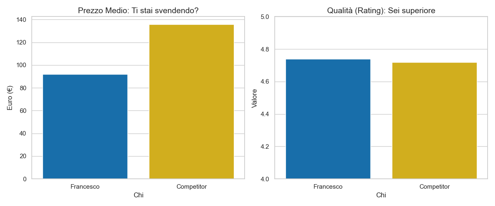
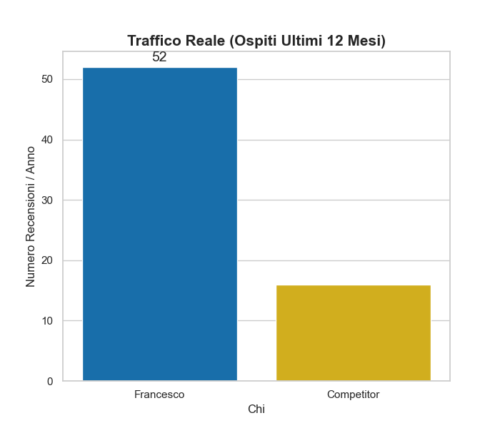

# Airbnb Competitor Analysis and Pricing Strategy: Naples Case Study

## Project Overview
This project executes a quantitative analysis of the Airbnb market in Naples, Italy, focusing on a specific host's performance relative to direct competitors. By leveraging Python for data processing and statistical analysis, the study identifies pricing inefficiencies and proposes a data-driven revenue optimization strategy.

**Objective:** Transition the hosting strategy from volume-based (low price, high occupancy) to value-based (higher margins, targeted positioning), aiming for a 25-30% revenue increase.

## Technical Architecture

### Tools and Libraries
* **Python 3.12:** Core analytical engine.
* **Pandas:** Used for ETL (Extract, Transform, Load) processes, cleaning raw datasets, and handling missing values.
* **NumPy:** Used for vectorised calculations of statistical distributions.
* **Seaborn / Matplotlib:** Used for data visualization and insight generation.

### Data Pipeline
1.  **Data Ingestion:** Parsed `listings.csv.gz` and `reviews.csv.gz` from InsideAirbnb.
2.  **Preprocessing:**
    * Currency sanitization (conversion of string formats to floats).
    * Imputation of missing values in review scores.
    * Outlier detection for price filtering.
3.  **Competitor Filtering:** Dynamic identification of the "Competitive Set" based on:
    * Geospatial proximity (Neighborhood matching).
    * Asset class (Entire home/apt).
    * Capacity specifications.

## Key Performance Indicators (KPIs)

The analysis focused on comparing the Client (Host ID) against the Market Average across three dimensions:

1.  **Average Daily Rate (ADR):** The realized booking price per night.
2.  **Review Scores Rating:** Aggregate measure of guest satisfaction and asset quality.
3.  **Traffic Volume (LTM):** Number of reviews in the Last Twelve Months, used as a proxy for occupancy and demand velocity.

## Analytical Findings

### 1. The Quality-Price Arbitrage
The data reveals a significant market anomaly. The Client maintains a quality rating superior to the market average but prices the asset significantly below the competitive threshold.

* **Client Rating:** 4.74 / 5.00
* **Market Average Rating:** 4.71 / 5.00
* **Price Gap:** The client is priced approximately **34% lower** than competitors with lower quality scores.

### 2. Demand Velocity and Real Occupancy
While calendar availability suggests low occupancy, the review velocity indicates the asset is performing exceptionally well in terms of volume, confirming underpricing.

* **Client Review Volume (LTM):** ~52 reviews
* **Competitor Review Volume (LTM):** ~15 reviews
* **Insight:** The client generates **3.5x** the traffic of the average competitor, suggesting the price elasticity of demand allows for a significant rate increase without critically impacting conversion.

## Strategic Recommendations

Based on the quantitative evidence, the following actions are recommended:

1.  **Price Correction:** Immediate increase of base ADR from €92 to a target range of **€115–€120**. This aligns the price with the asset's quality score (4.74).
2.  **Yield Management:** Implementation of dynamic pricing to capture surplus during high-demand windows (Summer/Holidays), moving strictly above the €140 threshold.
3.  **Target Repositioning:** Leverage the "Dedicated Workspace" amenity (identified in gap analysis) to target higher-yield segments such as remote workers, rather than budget-conscious tourists.

## Repository Structure
* `/data`: Contains raw and processed CSV datasets.
* `/output`: Generated charts and visualizations (.png).
* `/notebook`: Jupyter notebooks for exploratory data analysis (EDA).
* `airbnb_analysis.py`: Main execution script for the ETL pipeline and visualization generation.

## How to Run
1.  Clone the repository.
2.  Install requirements: `pip install pandas seaborn matplotlib`.
3.  Execute the script: `python airbnb_analysis.py`.